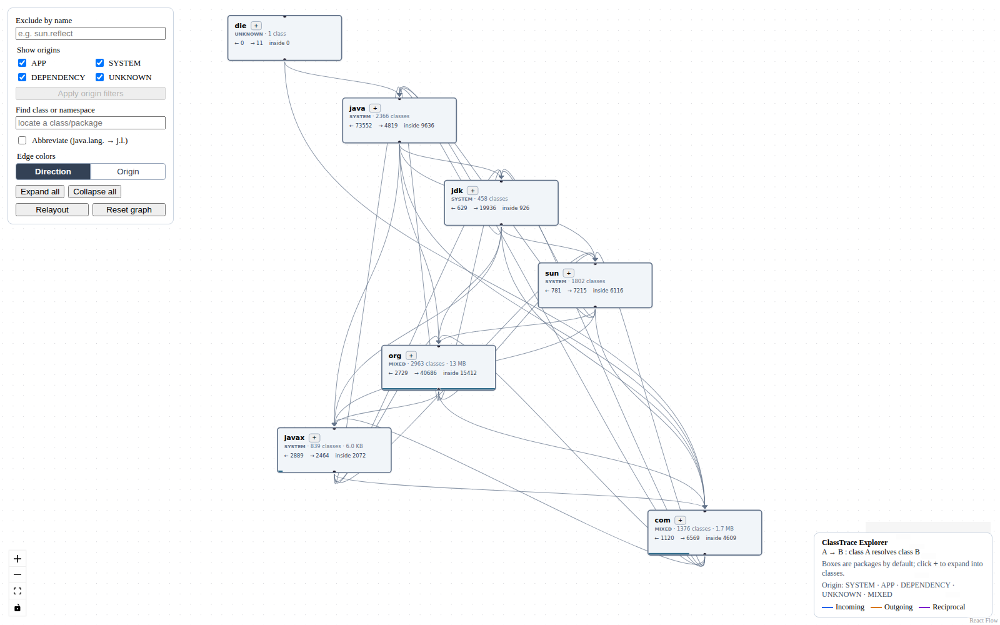

# ClassTrace Explorer

ClassTrace Explorer captures JVM class-resolution activity and turns it into an
interactive, self-contained HTML graph. It helps explain startup behavior,
application/runtime boundaries, dependency coupling, and unexpectedly loaded
code.

The 2.x release is written in TypeScript and rendered with
[React Flow](https://reactflow.dev). Python, Graphviz, and a report server are
not required.



## Features

- Launch a Java application and capture its class loads and resolutions.
- Import unified JDK 9+ logs or legacy JDK 8 class-resolution traces.
- Generate one portable HTML file containing the graph and its data.
- Navigate from namespaces to packages, outer types, inner classes, anonymous
  classes, and generated lambdas.
- Distinguish application, system, dependency, unknown, and mixed-origin nodes.
- Filter by origin or class name while retaining truthful hidden-edge counts.
- Inspect load source, timing, source locations, topology, and JVM annotations.
- Compare class-file bytecode footprint with truthful aggregate coverage.
- Search for a class or namespace and reveal its exact graph location.
- Preserve directed resolution edges at every aggregation level.

## Requirements

- Node.js 20 or newer when building from source
- A JDK when capturing an application

The built CLI supports Node.js 18 or newer.

## Install From Source

```bash
git clone https://github.com/menzew/class-trace-explorer.git
cd class-trace-explorer
npm ci
npm run build
npm install -g .
```

The installed command remains `clgrapher` for compatibility with earlier releases.

## Quick Start

Capture an executable JAR and write `my-app.html`:

```bash
clgrapher run my-app --jar path/to/application.jar
```

Capture a main class from a classpath:

```bash
clgrapher run my-app --cp build/classes com.example.Main
```

Pass a complete Java invocation after `--`:

```bash
clgrapher run my-app -- -cp build/classes com.example.Main argument
```

Open the resulting HTML file directly in a browser. Add `--view` to open it
automatically.

## Import A Trace

Capture with JDK 9 or newer:

```bash
java '-Xlog:class+resolve=debug,class+load=info:file=classload.txt' \
  -jar application.jar
clgrapher graph classload.txt application
```

For JDK 8 and earlier:

```bash
java -XX:+TraceClassResolution -jar application.jar > classload.txt
clgrapher graph classload.txt application
```

For imported traces, identify application code with repeatable hints:

```bash
clgrapher graph classload.txt application \
  --app-prefix com.example \
  --app-source /work/application.jar
```

## CLI Options

| Option                   | Purpose                                                         |
| ------------------------ | --------------------------------------------------------------- |
| `-abrv`                  | Start with abbreviated package labels.                          |
| `-f, --filter <text>`    | Start with matching class names excluded.                       |
| `--view`                 | Open the generated report.                                      |
| `--java <path>`          | Select the Java launcher for `run`.                             |
| `--keep-trace <file>`    | Preserve the temporary trace captured by `run`.                 |
| `--app-prefix <package>` | Mark a package prefix as application-owned; repeatable.         |
| `--app-source <path>`    | Mark a class directory or JAR as application-owned; repeatable. |

Run `clgrapher --help` or `clgrapher <command> --help` for the complete command
reference.

## Examples

The repository includes complete, interactive reports for a minimal HelloWorld
program, SwingSet3, and Apache NetBeans:

- [Browse the rendered example gallery](https://menzew.github.io/class-trace-explorer-demo/)
- [Open HelloWorld](https://menzew.github.io/class-trace-explorer-demo/examples/reports/helloworld.html)
- [Open SwingSet3](https://menzew.github.io/class-trace-explorer-demo/examples/reports/swingset.html)
- [Open Apache NetBeans](https://menzew.github.io/class-trace-explorer-demo/examples/reports/netbeans.html)

These are the same self-contained reports produced by the CLI, with all search,
filtering, expansion, directed-edge, and detail views enabled. GitHub's file
viewer displays HTML source; the links above run from a separate public demo
repository while this source repository is under private review. See
[examples/README.md](examples/README.md) for capture commands and report notes.

## Documentation

- [Architecture](docs/architecture.md)
- [Trace formats](docs/trace-formats.md)
- [Origin classification](docs/origin-classification.md)
- [Bytecode footprint](docs/bytecode-footprint.md)
- [Contributing](CONTRIBUTING.md)
- [Security policy](SECURITY.md)

## Development

```bash
npm ci
npm run check
npm run dev
```

`npm run build` creates the single-file web template at `dist/web/index.html`
and the CLI at `dist/cli/bin.js`.

## License

ClassTrace Explorer is available under the [BSD 3-Clause License](LICENSE.txt).
